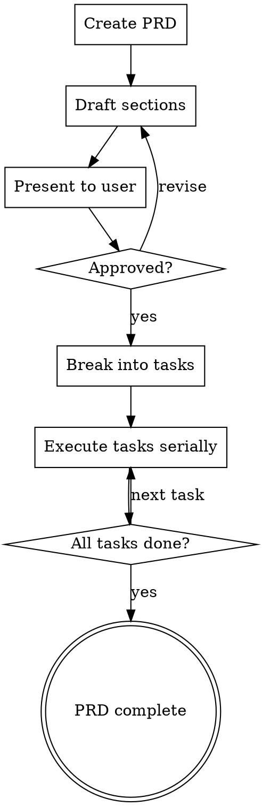

# PRD Workflow

Manages a hierarchical PRD (Product Requirements Document) → Task system for structured feature planning and execution. Bundles portable scripts for scaffolding PRDs and tasks in any project.

**This skill can write files.**

## When This Skill Applies

- User wants to plan a new feature or epic
- User says "PRD", "plan", "requirements", "break this down", "create tasks"
- Starting a multi-step implementation that needs structure
- User wants to track work with document-based project management

**Do NOT use for:** Simple bug fixes, one-file changes, or tasks that don't need planning.

## Setup

On first use in a project, check if `prd/` exists:

```bash
ls prd/ 2>/dev/null || echo "No prd/ directory"
```

If missing, create it:

```bash
mkdir -p prd
```

The bundled scripts live in this skill's `scripts/` directory. Run them with `PROJECT_ROOT` set to the target project:

```bash
PROJECT_ROOT=/path/to/project <skill-scripts-dir>/new-prd.sh "Feature Name"
PROJECT_ROOT=/path/to/project <skill-scripts-dir>/new-task.sh "prd-001-feature" "Task Name"
```

## Workflow



### Phase 1: Create PRD

Run the bundled script to scaffold:

```bash
PROJECT_ROOT=<project-root> <skill-scripts>/new-prd.sh "Feature Name"
```

This creates:
```
prd/prd-XXX-feature-name/
├── prd.md      # Main PRD document
└── tasks/      # Subtasks folder (empty until approved)
```

### Phase 2: Draft PRD

Fill in all sections of `prd.md`:

| Section | Purpose |
|---------|---------|
| Overview | Brief description and rationale |
| Linked Tickets | External issue tracker references |
| Measures of Success | How we know it's working |
| Low Effort Version | Minimal viable implementation |
| High Effort Version | Full-featured ideal solution |
| Possible Future Extensions | Deferred scope |
| Approval State | Draft → Reviewed → Approved |

Present the drafted PRD to the user for review. Update approval state based on feedback.

### Phase 3: Break Into Tasks

Once the PRD is approved, decompose it into sequential tasks:

```bash
PROJECT_ROOT=<project-root> <skill-scripts>/new-task.sh "prd-XXX-feature" "Task Name"
```

Each task gets YAML frontmatter with enforced structure:

```yaml
---
parent_prd: ../prd-XXX-feature/prd.md
prd_name: "PRD XXX: Feature Name"
prd_id: XXX
task_id: 001
created: 2026-02-22
state: pending
---
```

**Task sections:** Metadata, Changelog, Objective, Inputs, Outputs, Steps, Done Criteria, Notes.

Fill in each task's Objective, Steps, and Done Criteria before starting execution.

### Phase 4: Execute Tasks

Work through tasks sequentially (001 → 002 → 003...).

For each task:
1. Update `state` to `in_progress` in the frontmatter
2. Add a changelog entry
3. Complete the Steps and check off Done Criteria
4. Update `state` to `complete` when all Done Criteria are met
5. Add a final changelog entry

### Phase 5: Commit Work

Use the `version-control` skill (if installed) to commit changes after each task or logical unit of work.

## Task States

| State | Meaning |
|-------|---------|
| `pending` | Not yet started |
| `in_progress` | Currently being worked on |
| `complete` | All done criteria met |
| `failed` | Blocked or abandoned (add reason to Notes) |

## PRD Approval States

| State | Meaning |
|-------|---------|
| Draft | Initial writing, not reviewed |
| Reviewed | User has seen it, feedback incorporated |
| Approved | Ready for task breakdown and implementation |
| Superseded | Replaced by newer PRD |

## Guidelines

- **Always use the scripts** — never manually create PRD or task files
- **PRDs must be approved before creating tasks** — don't jump to implementation
- **Tasks execute serially** — finish 001 before starting 002
- **One task = one concern** — if a task covers multiple things, split it
- **Fill in Done Criteria before starting** — you need to know when you're done
- **Update state and changelog as you go** — the docs are the source of truth

## Common Mistakes

| Mistake | Fix |
|---------|-----|
| Skipping the PRD and jumping to code | Create PRD first, even for "simple" features |
| Empty Done Criteria | Fill in specific, verifiable criteria before starting |
| Tasks too large | Each task should be completable in one session |
| Not updating state | Update frontmatter state as you progress |
| Manual file creation | Always use the bundled scripts |
| Starting task 002 before 001 is complete | Tasks are sequential — finish in order |

## Resources

### scripts/
- `new-prd.sh` — creates a new PRD with auto-incremented ID and folder structure
- `new-task.sh` — creates a new task within a PRD with enforced YAML frontmatter

Both scripts are portable. Set `PROJECT_ROOT` to the target project root before running.
