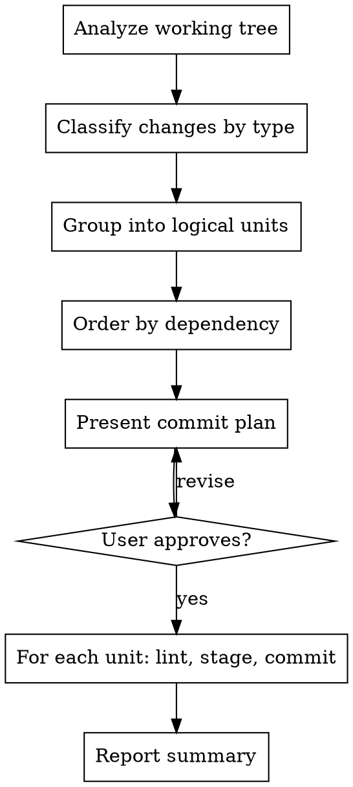

# Version Control

Guides agents through clean git hygiene: analyze working tree changes, group them into logical micro-commits with Conventional Commit messages, and commit incrementally.

## When This Skill Applies

- Agent has completed implementation work and needs to commit
- User says "commit", "push", "save changes", "version control"
- Another skill (TDD, executing-plans, subagent-driven-development) finishes a task
- Working tree has unstaged/staged changes ready to persist

**Do NOT use for:** branch creation, merging, PRs, or pushing (see `finishing-a-development-branch`).

## Workflow



### Phase 1: Analyze Changes

1. Run `git status` (never use `-uall`) and `git diff` (staged + unstaged).
2. Run `git log --oneline -5` to match existing commit message style.
3. For each changed file, classify the change:

| Type | When |
|------|------|
| `feat` | New functionality, new files implementing features |
| `fix` | Bug fixes, correcting wrong behavior |
| `refactor` | Restructuring without behavior change |
| `test` | Adding or updating tests |
| `docs` | Documentation, comments, READMEs |
| `style` | Formatting, whitespace, linting fixes (no logic change) |
| `chore` | Config, dependencies, build scripts, maintenance |

4. Group files into **logical units** — files that belong to the same concern:
   - A new function + its tests = **2 commits** (feat, then test)
   - A bug fix + its test update = **1 commit** (fix)
   - Formatting across multiple files = **1 commit** (style)
   - Unrelated changes in the same file = **split with `git add -p`**

5. Order units by dependency: source before tests, base modules before consumers.

### Phase 2: Lint & Format

Before staging, check for Makefile targets:

```bash
# Check for lint/format targets
grep -qE '^(lint|format|check|fmt)\s*:' Makefile 2>/dev/null
```

**If Makefile targets exist:** Run them (e.g., `make format && make lint`).
- If formatter changed files, include those changes in the appropriate commit.
- If formatter touched files *outside* the current logical unit, make a separate `style` commit.

**If no Makefile targets exist:** Warn and continue.
```
Warning: No Makefile lint/format targets found. Skipping pre-commit formatting.
```

Do NOT block commits over missing lint tooling.

### Phase 3: Plan & Approve

Present the commit plan as a numbered list:

```
Commit plan (3 commits):

1. feat(auth): add login endpoint
   Files: src/auth/login.py, src/auth/validators.py

2. test(auth): add login endpoint tests
   Files: tests/test_login.py

3. style(auth): format auth module
   Files: src/auth/login.py, src/auth/validators.py
```

**If running in a subagent or autonomous mode:** Execute without approval.
**If running interactively:** Wait for user confirmation before executing.

### Phase 4: Execute Commits

For each logical unit in order:

```bash
# Stage SPECIFIC files only — never git add . or git add -A
git add src/auth/login.py src/auth/validators.py

# Commit with conventional message via HEREDOC
git commit -m "$(cat <<'EOF'
feat(auth): add login endpoint

Co-Authored-By: Claude Opus 4.6 <noreply@anthropic.com>
EOF
)"
```

After each commit, verify it succeeded before proceeding to the next.

### Phase 5: Report

```
Committed 3 changes:

  abc1234 feat(auth): add login endpoint
  def5678 test(auth): add login endpoint tests
  ghi9012 style(auth): format auth module

Remaining uncommitted: none
```

If any files remain uncommitted, list them with a note explaining why they were skipped.

## Commit Message Format

```
type(scope): imperative description

[optional body — explain WHY, not WHAT]

[optional footer — breaking changes, issue refs]

Co-Authored-By: Claude Opus 4.6 <noreply@anthropic.com>
```

**Rules:**
- Subject line: imperative mood, ≤72 chars, no trailing period, lowercase after colon
- Scope: the module, directory, or feature area (e.g., `auth`, `practice`, `api`)
- Body: wrap at 72 chars, separated from subject by blank line
- Always include `Co-Authored-By` trailer

**Types:** `feat`, `fix`, `refactor`, `test`, `docs`, `style`, `chore`, `perf`, `ci`, `build`

**Breaking changes:** Add `!` after scope: `feat(api)!: remove v1 endpoints`

## Guidelines

- **Never `git add .` or `git add -A`** — always stage specific files by name
- **Never auto-push** — committing and pushing are separate concerns
- **Never amend** previous commits unless the user explicitly asks
- **Never use `--no-verify`** — respect pre-commit hooks
- **One concern per commit** — if you have to use "and" in the subject, split it
- **Tests get their own commit** unless they're part of a bug fix
- **Formatting gets its own commit** unless it only touches files in the current unit
- **Dependency order matters** — commit base modules before consumers, source before tests

## Common Mistakes

| Mistake | Fix |
|---------|-----|
| One giant commit for everything | Split by logical unit: feat, test, style separately |
| `git add .` catching unintended files | Stage specific files by name |
| "Update files" as commit message | Use `type(scope): imperative description` |
| Amending when commit failed hooks | Fix the issue, create a NEW commit |
| Committing .env or credentials | Check file names before staging — skip sensitive files |
| Mixing formatting with logic changes | Separate `style` commit for format-only changes |

## Red Flags — STOP

- About to `git add .` → Stage specific files instead
- Commit message uses past tense ("added") → Rewrite in imperative ("add")
- Commit message > 72 chars → Shorten subject, move detail to body
- Staging a `.env`, credentials, or secrets file → Skip it, warn user
- About to amend after a hook failure → The commit didn't happen, create NEW commit

## Integration

**Called by:** Any skill that produces code changes (TDD, executing-plans, subagent-driven-development)

**Hands off to:** `finishing-a-development-branch` for push/merge/PR decisions
