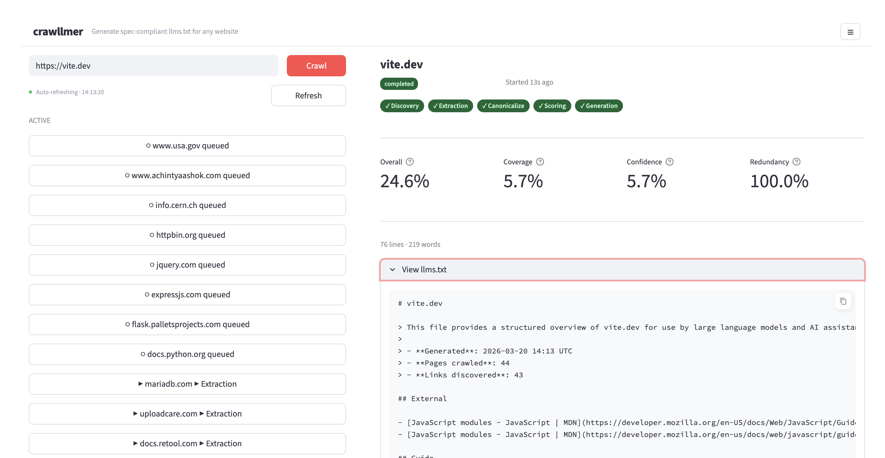
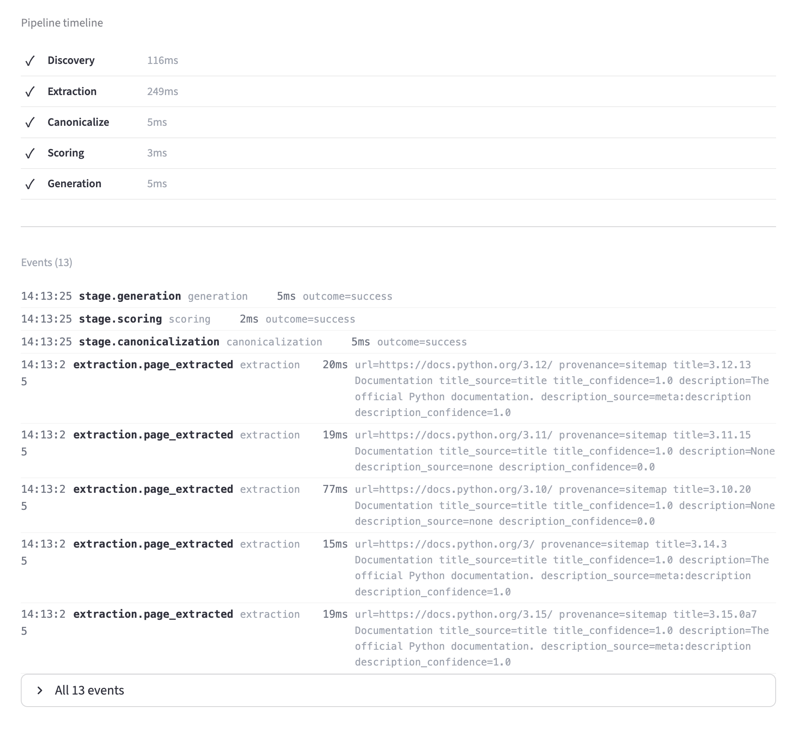
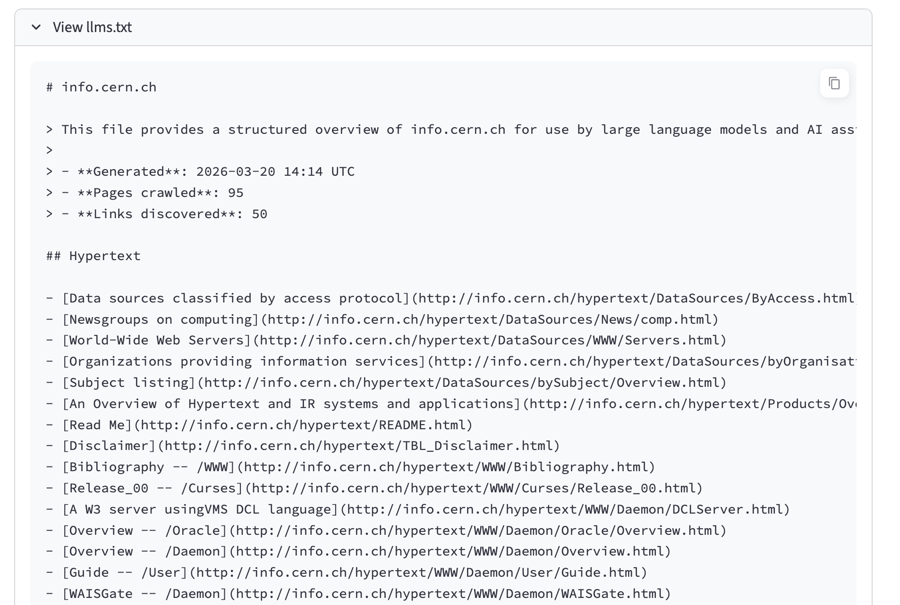
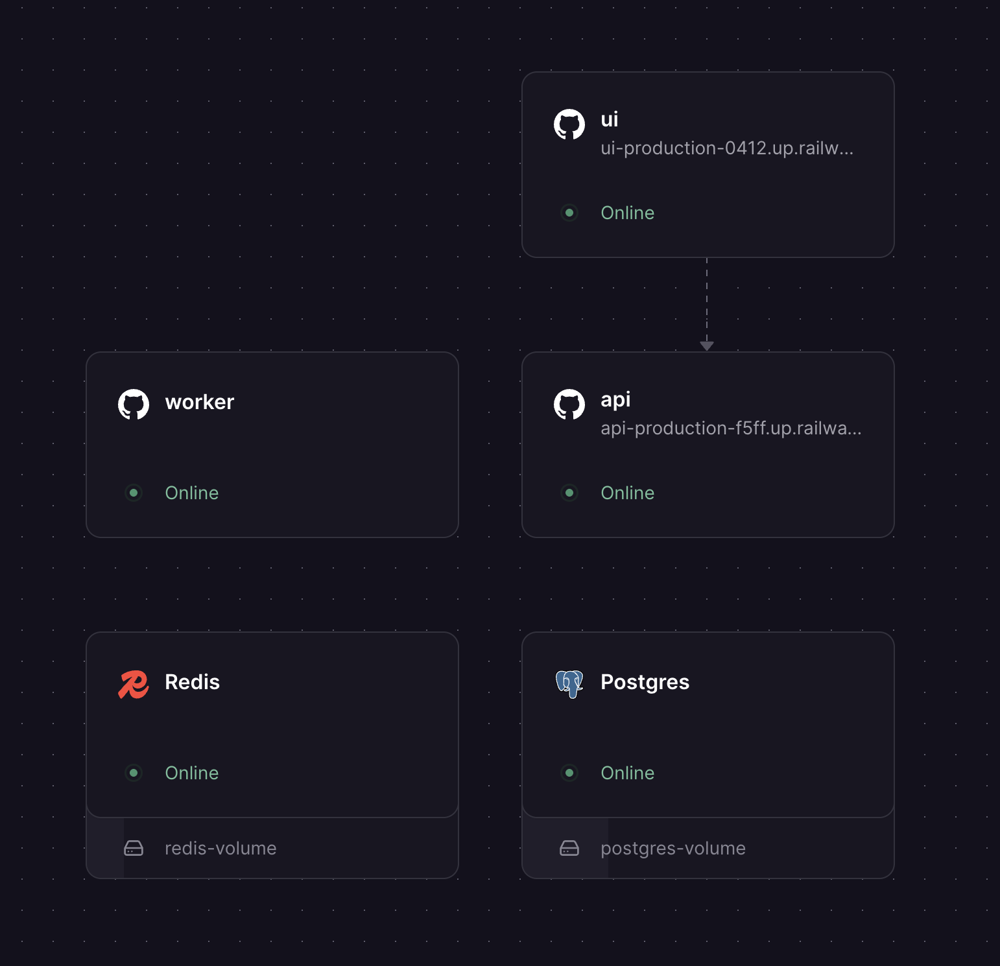

# crawllmer

[](https://www.python.org/)
[](https://fastapi.tiangolo.com/)
[](https://streamlit.io/)
[](https://docs.celeryq.dev/)
[](https://docs.astral.sh/uv/)
[](https://docs.astral.sh/ruff/)
[](https://docs.docker.com/compose/)

A queue-driven web application that generates spec-compliant [llms.txt](https://llmstxt.org/) files for any website. Input a URL, and crawllmer discovers pages, extracts metadata, scores quality, and produces a downloadable `llms.txt` — all through a REST API or Streamlit UI.

## Quick Start

Using [Claude Code](https://claude.ai/code)? Run `/proj-setup` for a guided walkthrough that generates your `.env` and verifies everything works.

```bash
make sync
cp .env.example .env   # adjust values as needed
make run-dev           # start API + Streamlit UI + Celery worker
```

Verify it's running:

```bash
curl -s http://localhost:8000/health          # → {"status": "ok"}
open http://localhost:8501                     # Streamlit UI
```

### Generate an llms.txt

```bash
# 1. Enqueue a crawl
curl -X POST http://localhost:8000/api/v1/crawls \
  -H 'content-type: application/json' \
  -d '{"url":"https://example.com"}'
# → {"run_id": "<RUN_ID>", "status": "queued"}

# 2. Process it (synchronous — returns when done)
curl -X POST http://localhost:8000/api/v1/crawls/<RUN_ID>/process
# → {"run_id": "...", "status": "completed", "score": 0.85, "score_breakdown": {...}}

# 3. Download the result
curl http://localhost:8000/api/v1/crawls/<RUN_ID>/llms.txt
```

Or use the Streamlit UI at `http://localhost:8501` — paste a URL, click **Crawl**, and watch the pipeline stages progress in real time.

### What it looks like

Queue up multiple crawls and watch them process in parallel:



Drill into a completed crawl to see the pipeline timeline and event log:



View the generated llms.txt output directly in the UI:



## Try It Live

> **Note:** This deployment is temporary and will not be supported long-term. It exists as a demo of the fully deployed system.

crawllmer is deployed on [Railway](https://railway.app/) with five services: the Streamlit UI, FastAPI API, Celery worker, Redis (broker), and Postgres (database). Each service uses the same `Dockerfile` with a per-service `railway.toml` override (see [`railway/`](railway/)).

| Service | URL |
|---------|-----|
| Streamlit UI | [ui-production-0412.up.railway.app](https://ui-production-0412.up.railway.app/) |
| API (Swagger docs) | [api-production-f5ff.up.railway.app/docs](https://api-production-f5ff.up.railway.app/docs) |



## How It Works

crawllmer runs a five-stage pipeline for every URL:

```
URL → Discovery → Extraction → Canonicalization → Scoring → Generation → llms.txt
```

1. **Discovery** — Probes `/llms.txt`, `robots.txt`, `sitemap.xml`; falls back to BFS spider crawl
2. **Extraction** — Fetches each discovered page and extracts titles and descriptions from `<head>` meta, Open Graph, Twitter cards, and JSON-LD
3. **Canonicalization** — Normalizes URLs and deduplicates entries, keeping the highest-confidence metadata
4. **Scoring** — Computes a quality score: `(coverage × 0.4) + (confidence × 0.4) + (redundancy × 0.2)`
5. **Generation** — Builds a deterministic, sorted `llms.txt` document conforming to the [spec](https://llmstxt.org/)

Full pipeline details: **[guides/pipeline.md](guides/pipeline.md)**

## Running the Server

### Local Development

```bash
make run-api              # FastAPI on :8000
make run-ui               # Streamlit on :8501
make run-worker           # Celery worker (SQLite broker)
make run-dev              # All three together
```

The default configuration uses SQLite for everything — no external services required.

### Docker (simple)

Everything local with SQLite for the database, broker, and result backend. No external services needed.

```bash
make docker-up        # API + Worker + UI (SQLite for everything)
```

| Service | URL |
|---------|-----|
| API | [http://localhost:8000](http://localhost:8000) |
| Streamlit UI | [http://localhost:8501](http://localhost:8501) |

### Docker (production-like)

Full distributed stack: Postgres for the database, Redis for the Celery broker, and the complete OTEL observability suite.

```bash
make docker-up-production-like
```

| Service | URL | Purpose |
|---------|-----|---------|
| API | [http://localhost:8000](http://localhost:8000) | REST API + Swagger docs at `/docs` |
| Streamlit UI | [http://localhost:8501](http://localhost:8501) | Web interface |
| Jaeger | [http://localhost:16686](http://localhost:16686) | Distributed trace viewer |
| Prometheus | [http://localhost:9090](http://localhost:9090) | Metrics dashboard |
| Grafana | [http://localhost:3000](http://localhost:3000) | Dashboards (anonymous admin, no login) |
| OTEL Collector | localhost:4317 (gRPC) | Receives telemetry from API + worker |
| Postgres | localhost:5432 | Application database |
| Redis | localhost:6379 | Celery broker + result backend |

Full deployment guide: **[guides/deployment.md](guides/deployment.md)**

## API Reference

| Method | Endpoint | Description |
|--------|----------|-------------|
| `GET` | `/health` | Health check |
| `POST` | `/api/v1/crawls` | Enqueue a crawl (`{"url": "https://..."}`) |
| `POST` | `/api/v1/crawls/{run_id}/process` | Execute the pipeline synchronously |
| `GET` | `/api/v1/crawls/{run_id}` | Get run status and score |
| `GET` | `/api/v1/crawls/{run_id}/llms.txt` | Download generated llms.txt |
| `GET` | `/api/v1/crawls/{run_id}/work-items` | Get pipeline stage work items |
| `GET` | `/api/v1/crawls/{run_id}/events` | Get pipeline event log |
| `GET` | `/api/v1/history` | List recent runs (optional `?host=` filter) |

Full API details with request/response shapes: **[guides/api.md](guides/api.md)**

## Configuration

```bash
cp .env.example .env    # SQLite defaults — works out of the box
```

| Variable | Default | Purpose |
|----------|---------|---------|
| `CRAWLLMER_STORAGE_BACKEND` | `sqlite` | Database backend: `sqlite` or `pgsql` |
| `CRAWLLMER_DB_URL` | `sqlite:///./crawllmer.db` | SQLite connection URL |
| `CRAWLLMER_CELERY_BROKER_URL` | `sqla+sqlite:///./celery-broker.db` | Celery broker (use `redis://` for Redis) |
| `CRAWLLMER_CELERY_RESULT_BACKEND` | `db+sqlite:///./celery-results.db` | Celery results (use `redis://` for Redis) |
| `CRAWLLMER_LOG_LEVEL` | `DEBUG` | Logging severity |

For Postgres, Redis, Docker profiles, OTEL, and all other variables: **[guides/environment.md](guides/environment.md)**

## Architecture

The project follows a **hexagonal architecture** (ports & adapters):

```
     ┌──────────────┐        ┌──────────────────────────────────┐
     │ Streamlit UI │──HTTP──│          FastAPI (REST API)       │
     └──────────────┘        └──────────┬───────────────────────┘
                                        │
                             ┌──────────▼───────────────────────┐
                             │        Application Core           │
                             │                                   │
                             │  CrawlPipeline   Spider   Workers │
                             │  RetryPolicy     Scheduler        │
                             └──────────┬───────────┬───────────┘
                                        │           │
                          ┌─────────────▼──┐  ┌─────▼──────────┐
                          │  Domain Layer  │  │   Adapters      │
                          │                │  │                 │
                          │ Models (Pydantic)│ │ StorageRepo    │
                          │ Ports (ABCs)   │  │ CeleryPublisher│
                          └────────────────┘  └────────────────┘
```

Source code in `src/crawllmer/`:

```
src/crawllmer/
├── core/               # config, errors, orchestrator, retry, scheduler, scoring, generation
│   └── observability/  # telemetry_setup, pipeline_telemetry, events
├── domain/             # models.py, ports.py — pure domain logic and abstract interfaces
├── adapters/           # storage.py — SQLModel persistence (SQLite + Postgres)
└── app/                # Three application runtimes
    ├── api/            # main.py (FastAPI), routes.py (endpoints)
    ├── web/            # streamlit_app.py (UI), api_client.py (HTTP client), runtime.py
    └── indexer/        # app.py (Celery), workers.py, spider.py, page_indexer.py, link_filter.py
```

Full architecture documentation: **[docs/architecture.md](docs/architecture.md)**

## Design Decisions

- **Hexagonal architecture** — Domain and application logic have zero imports from web or storage layers. Adapters implement abstract ports, so you can swap SQLite for Postgres or Celery for any queue without touching business logic.

- **Hierarchical discovery** — Instead of blindly crawling, we check `/llms.txt` first (the source of truth), then `robots.txt` hints, then `sitemap.xml`, and only fall back to the seed URL. This respects existing llms.txt files and produces better results.

- **Confidence-scored extraction** — Every metadata extraction (title, description) carries a confidence score based on its source. `<title>` tags get 1.0, Open Graph gets 0.8, JSON-LD gets 0.6. During deduplication, the highest-confidence entry wins.

- **Deterministic output** — `llms.txt` entries are sorted by URL, making output reproducible and diffable.

- **SQLite everywhere** — SQLite serves as the app database, Celery broker, and result backend. Zero external dependencies for local dev. Redis is available as a compose extension for production.

- **Work-item state machine** — Every pipeline stage is tracked as a work item with `queued → processing → completed/failed` transitions and an event audit trail.

More on architecture and design: **[docs/architecture.md](docs/architecture.md)** and **[docs/design_decisions.md](docs/design_decisions.md)**

## Testing

```bash
make test                 # run all tests
make check                # format + lint + test (quality gate)
```

Run a single test:

```bash
uv run pytest tests/unit/test_workers.py::test_extracts_title_and_description_from_head_meta -v -s
```

Test structure:

```
tests/
├── conftest.py                  # Shared fixtures, test DB cleanup
├── unit/
│   ├── test_models.py           # Domain model state machine, serialization
│   ├── test_orchestrator.py     # Pipeline orchestration logic
│   ├── test_workers.py          # Discovery, extraction, scoring functions
│   ├── test_errors.py           # Typed error hierarchy
│   ├── test_events.py           # Structured observability events
│   ├── test_config_log_level.py # Configuration, logging, spider settings
│   ├── test_link_filter.py      # BeautifulSoup link extraction + filtering
│   ├── test_spider.py           # BFS spider scan + ranking
│   └── test_page_indexer.py     # Single-page fetch + extract
└── integration/
    ├── test_api.py              # FastAPI endpoint tests
    └── test_pipeline_flow.py    # End-to-end pipeline with mocked HTTP
```

## Development

```bash
make sync                 # install/sync dependencies
make format               # auto-format with ruff
make lint                 # lint with ruff
make fix                  # format + auto-fix lint issues
make check                # format → lint → test (run before committing)
make test-one T=path      # run a single test
make clean                # remove venv, caches, and DB files
make stop                 # kill running server processes
make restart              # stop → clean DBs → start fresh
make inttest              # submit integration test URLs
make crawl-status         # show status of all crawl runs
```

Full Makefile reference: run `make help` or see the [Makefile](Makefile) (all targets are commented).

### Code Style

- **Formatter/Linter**: Ruff (line-length 88, target py312)
- **Lint rules**: E (errors), F (pyflakes), I (isort), N (naming), UP (upgrades)
- **Commits**: [Conventional Commits](https://www.conventionalcommits.org/) — `type(scope): imperative description`

## Guides

| Guide | Description |
|-------|-------------|
| [Pipeline](guides/pipeline.md) | Deep dive into the five-stage processing pipeline |
| [API Reference](guides/api.md) | Complete API documentation with request/response examples |
| [Deployment](guides/deployment.md) | Local, Docker, and distributed deployment options |
| [Environment](guides/environment.md) | All configuration variables, storage backends, Docker profiles |
| [llms.txt Generation](guides/llms-txt-generation.md) | Output format, section grouping, caveats, and known limitations |

## Documentation

| Document | Description |
|----------|-------------|
| [Architecture](docs/architecture.md) | System architecture, hexagonal design, and runtime topology |
| [Design Decisions](docs/design_decisions.md) | Trade-offs and rationale behind key technical choices |
| [Integration Test Plan](docs/integration-test-plan.md) | Test matrix with 13 sites across 3 categories |
| [Project Requirements](docs/project_requirements.md) | Original assignment specification |
| [PRDs](prd/) | Product requirement documents for each feature area |

## Keeping Docs Up to Date

This project includes a Claude Code slash command for refreshing documentation after code changes:

```
/proj-refresh-docs
```

It reads the current source code, diffs against the existing docs, and surgically updates only what's stale — README sections, guides, docs, and Makefile comments. See [`.claude/commands/proj-refresh-docs.md`](.claude/commands/proj-refresh-docs.md) for the full specification including README structure rules, guides vs docs guidelines, and negative examples.

### `/proj-setup` — Guided Project Setup

```
/proj-setup
```

Interactive questionnaire that walks you through runtime mode (local/Docker/distributed), storage backend (SQLite/Postgres), Celery broker, and OTEL — then generates your `.env` file and verifies the setup.
