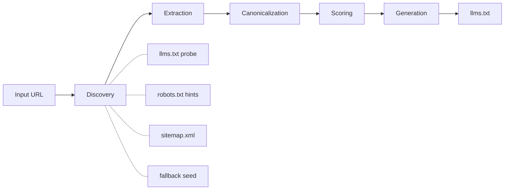
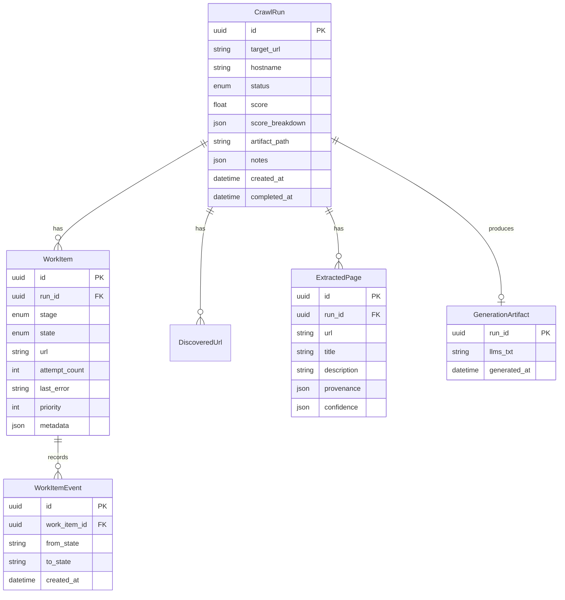

# Architecture

crawllmer follows a **hexagonal architecture** (ports & adapters) — domain and application logic are isolated from web, storage, and queue adapters.

## System Overview

```
                    ┌───────────────────────────────────────────┐
                    │             Interface Layer                │
                    │                                           │
                    │   FastAPI (:8000)     Streamlit (:8501)   │
                    └──────────┬────────────────────┬───────────┘
                               │                    │
                    ┌──────────▼────────────────────▼───────────┐
                    │           Application Core                │
                    │                                           │
                    │   CrawlPipeline    Workers    Scheduler   │
                    │   RetryPolicy      Observability          │
                    └──────────┬────────────────────┬───────────┘
                               │                    │
               ┌───────────────▼──────┐  ┌──────────▼──────────┐
               │    Domain Layer      │  │    Adapters          │
               │                      │  │                      │
               │  Models (Pydantic)   │  │  SqliteCrawlRepo     │
               │  Ports (ABCs)        │  │  CeleryQueuePublisher│
               └──────────────────────┘  └──────────────────────┘
```

## Layer Responsibilities

### Domain (`src/crawllmer/domain/`)

Pure domain logic with no external dependencies.

- **`models.py`** — Enums (`RunStatus`, `WorkStage`, `WorkItemState`, `DiscoverySource`), Pydantic models (`WebsiteTarget`, `LlmsTxtEntry`, `LlmsTxtDocument`, `SitemapUrl`, `StrategyInput/Output`), and dataclasses (`CrawlRun`, `WorkItem`, `ExtractedPage`, `GenerationArtifact`). The `WorkItem.transition()` method enforces the state machine.

- **`ports.py`** — Abstract base classes defining the contracts that adapters implement:
  - `CrawlRepository` — 14 methods for CRUD on runs, work items, discovered URLs, extracted pages, validators, and artifacts
  - `QueuePublisher` — `publish(queue_name, payload)` for task dispatch

### Core (`src/crawllmer/core/`)

Shared business logic and cross-cutting concerns.

- **`config.py`** — Pydantic Settings with `CRAWLLMER_` env var prefix. Singleton via `get_settings()`.

- **`orchestrator.py`** — `CrawlPipeline` coordinates the five-stage pipeline. `enqueue_run()` creates the run and publishes to the queue. `process_run()` builds a stage plan and executes each stage with state tracking.

- **`retry.py`** — `RetryPolicy` wraps functions with exponential backoff (2 retries, 50ms base, 2× multiplier).

- **`scheduler.py`** — `HostRateLimiter` enforces per-host request delays (10ms base, 50ms adaptive penalty).

- **`errors.py`** — Typed exception hierarchy: `CrawllmerError` base, `InvalidInputError`, `RunNotFoundError`, `PipelineProcessingError`, `CrawlFetchError`, `ContentExtractionError`, `GenerationError`.

- **`observability/`** — `telemetry_setup.py` (OTEL SDK bootstrap), `pipeline_telemetry.py` (metrics + spans), `events.py` (structured event classes + `BusinessMetrics`).

### Adapters (`src/crawllmer/adapters/`)

Concrete implementations of domain ports.

- **`storage.py`** — SQLModel table definitions and `SqliteCrawlRepository` implementing all `CrawlRepository` methods. `default_repository()` is a factory that creates a repository with engine and table initialization.

### App (`src/crawllmer/app/`)

Three application runtimes sharing core, domain, and adapters.

#### API (`app/api/`)

- **`main.py`** — FastAPI app instance with OTEL lifespan hook. Uvicorn entrypoint.
- **`routes.py`** — API endpoints: health, enqueue, process, status, download, events, history.

#### Web (`app/web/`)

- **`streamlit_app.py`** — Master-detail UI with navbar, active crawl tracking, live events, score metrics, and llms.txt preview.
- **`runtime.py`** — Shared module that initializes `repo`, `queue`, and `pipeline` singletons.

#### Indexer (`app/indexer/`)

- **`app.py`** — Celery app instance and configuration. Importable without starting a worker.
- **`__main__.py`** — Worker entrypoint (`python -m crawllmer.app.indexer`).
- **`workers.py`** — Pipeline stage functions: `discover_urls()`, `extract_metadata()`, `canonicalize_and_dedup()`, `score_pages()`, `generate_llms_txt()`.
- **`queueing.py`** — `CeleryQueuePublisher` implements the `QueuePublisher` port.

## Processing Pipeline



Each stage creates a `WorkItem` and transitions it through `queued → processing → completed/failed`. State transitions are recorded as `WorkItemEventRecord` entries for auditability.

See [guides/pipeline.md](../guides/pipeline.md) for full stage documentation.

## Runtime Topology

```
┌──────────────┐     ┌──────────────┐     ┌──────────────┐
│   FastAPI     │     │  Streamlit   │     │ Celery Worker│
│   :8000       │     │  :8501       │     │              │
└──────┬───────┘     └──────┬───────┘     └──────┬───────┘
       │                    │                    │
       └────────────┬───────┘                    │
                    │                            │
              ┌─────▼──────┐              ┌──────▼──────┐
              │  runtime.py │              │ celery_app  │
              │  (shared)   │              │  .py        │
              └─────┬──────┘              └──────┬──────┘
                    │                            │
              ┌─────▼────────────────────────────▼─────┐
              │         Application Core               │
              │   CrawlPipeline + Workers + Ports       │
              └─────┬──────────────────────┬───────────┘
                    │                      │
              ┌─────▼──────┐        ┌──────▼──────┐
              │   SQLite   │        │ Celery Queue│
              │  (storage) │        │ (SQLite or  │
              │            │        │  Redis)     │
              └────────────┘        └─────────────┘
```

- **API process** — Uvicorn serving FastAPI. Handles HTTP requests, delegates to pipeline.
- **UI process** — Streamlit app. Shares the same runtime (repository, pipeline) as the API.
- **Worker process** — Celery worker. Dequeues tasks and runs the pipeline.
- **Shared core** — All three processes use the same domain models, orchestrator, and worker functions.
- **Persistence** — SQLite file stores crawl runs, work items, extracted pages, and artifacts.

## Data Model



## Dependency Flow

```
web/app.py ──────────┐
web/streamlit_app.py ─┤
                      ▼
               web/runtime.py
                      │
          ┌───────────┼───────────┐
          ▼           ▼           ▼
   adapters/      application/  application/
   storage.py     orchestrator  queueing.py
          │           │
          ▼           ▼
     domain/ports.py ←┘
          │
          ▼
     domain/models.py
```

The dependency arrows point inward: web → application → domain. Adapters implement domain ports. No layer imports from a layer above it.
