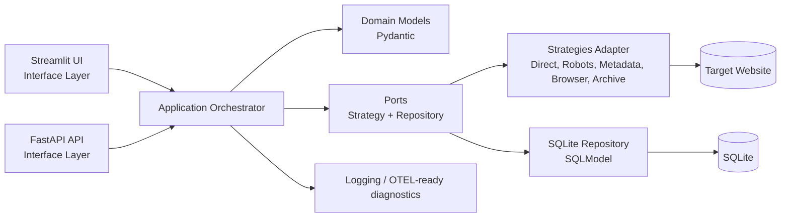

# crawllmer Architecture

The system follows a hexagonal architecture: domain and application core are isolated
from web, storage, and crawl strategy adapters.

## Runtime topology

- **API process**: Uvicorn serving FastAPI (`/health`, `/api/v1/*`).
- **UI process**: Streamlit app for operators and users.
- **Shared core**: Both UI and API invoke the same orchestrator/runtime module.
- **Persistence**: SQLite file stores crawl history and strategy outcomes.
